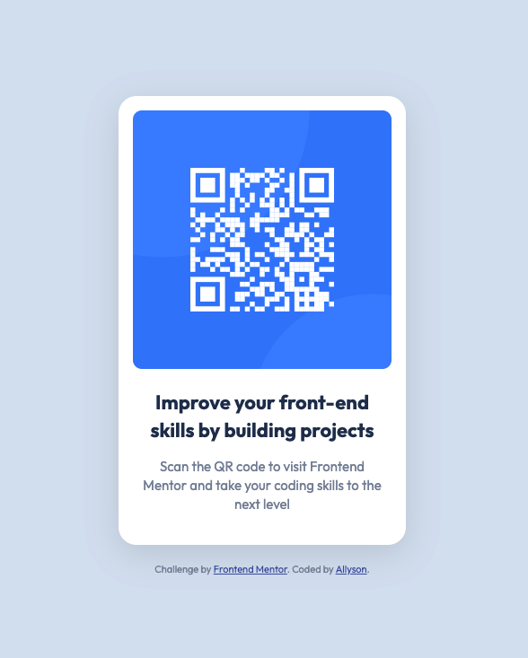

# Frontend Mentor - QR code component solution

This is a solution to the [QR code component challenge on Frontend Mentor](https://www.frontendmentor.io/challenges/qr-code-component-iux_sIO_H). Frontend Mentor challenges help you improve your coding skills by building realistic projects.

## Table of contents

- [Overview](#overview)
  - [Screenshot](#screenshot)
  - [Links](#links)
- [My process](#my-process)
  - [Built with](#built-with)
  - [What I learned](#what-i-learned)
  - [Continued development](#continued-development)
- [Author](#author)

**Note: Delete this note and update the table of contents based on what sections you keep.**

## Overview

### Screenshot



### Links

- Solution URL: [https://allyson-s-code.github.io/qr-code/](https://allyson-s-code.github.io/qr-code/)

## My process

### Built with

- Semantic HTML5 markup
- CSS custom properties
- Flexbox

### What I learned

This was a basic project built out from a jpeg design file using HTML and CSS. It went smoothly except I stumbled a bit on vertically aligning my column elements within the browser. In the end adding a height to the body element and giving it a `100vh` value (along with `justify-content: center;`) did the trick.

```css
body {
  background-color: hsl(212, 45%, 89%);
  font-size: 1em;
  text-align: center;
  color: hsl(220, 15%, 55%);
  display: flex;
  flex-direction: column;
  align-items: center;
  height: 100vh;
  justify-content: center;
}
```

### Continued development

I plan on working on more responsive and interactive projects (HTML, CSS, JavaScript) while getting more comfortable with setting up my own projects.

## Author

- Website - [Add your name here](https://allyson-s-code.github.io/Web-Dev-Portfolio/)
- Frontend Mentor - [@allyson-s-code](https://www.frontendmentor.io/profile/allyson-s-code)
